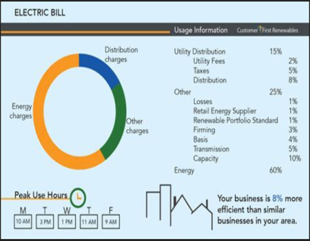
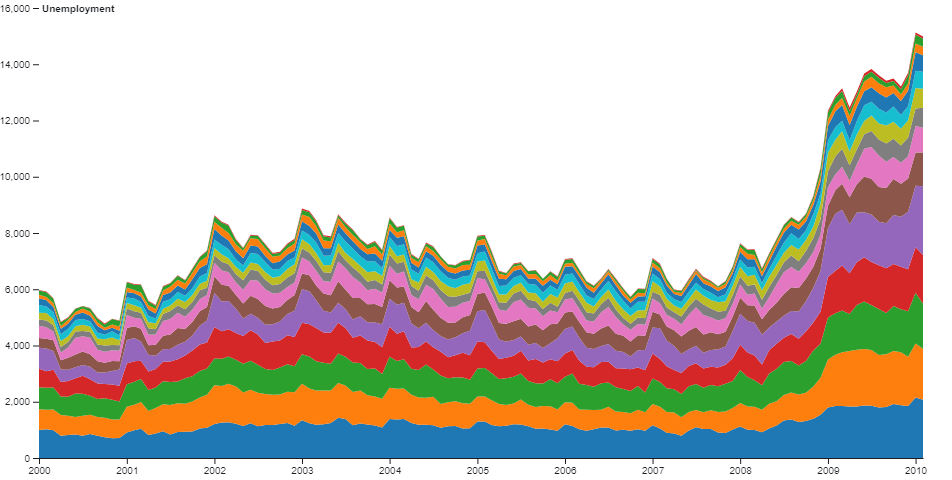
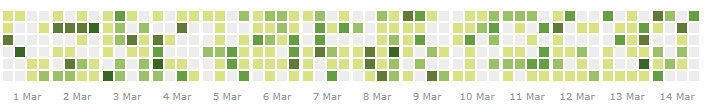
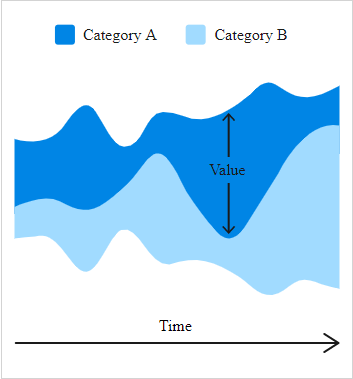
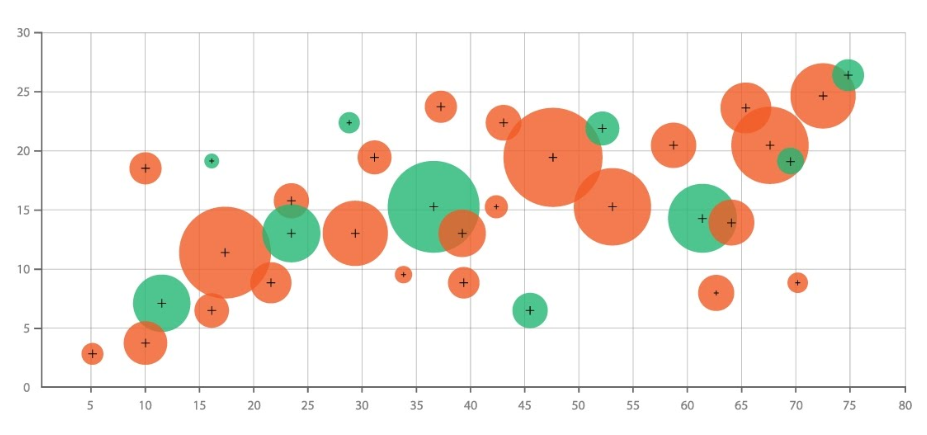
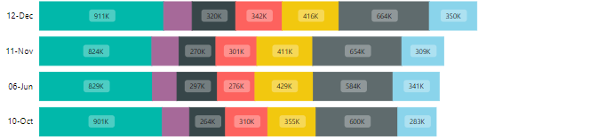

# Arrow Dynamics

## Basic Info ##
Project Name: Energy Awareness

### Team Members:
Daniel Marsden
A02256379
marsden.daniel@gmail.com

Spencer Griffin
A01653454
xcgriffs@gmail.com

Git Repo:
https://github.com/gitdaddy/CS5890_arrow_dynamics_vis

----

## Background and Motivation ##

When we found the Tacebase dataset on appliance power usage, we pictured it's usefulness for people who want to better understand their power consumption. Understanding power trends in your home environment can help lead to more efficient living and reduce spending. Most if not all of us have to pay for power expenses. Being able to quickly analyze real world data can help provide critical insight into our own consumption footprint.

----

## Related Work ##

Nobody likes paying a big electric bill. Expenses can fluctuate throughout the year depending on energy needs. Related work in the past traditionally has been done using meter hardware and detailed reports from the electric companies.
Typical Energy Report:

----

## Questions ##

### Primary Questions - what we want to learn
 1.  What item(s) have the greatest impact on power consumption?
 2.  What are typical trends throughout the week/month?
 3.  How do items compare in their power draw?

### Benefits
1. Allow the user to identify appliance upgrades that would have the most benefit

2. Reduced energy costs and consumption

3. Allow user to optimize appliance usage and recognize potential issues.

----

## Data ##
We got our data from a github repository called tracebase.
The data contains timestamps for specific appliances and their power draw for that time.

Each item will contain the following format when parsed:
Date: "1/11/2011 00:00:04"
CurrentVal: 2
AverageVal: 3 // value averaged over a few number of seconds

We will be placing the data into records. Each record holds all the keys for each item.
This will allow us to easily treat all values as the same.

The entire dataset will be composed of a list key timestamps to record values.
This will make it easy to get and set values have have already been initialized for that date time.

The dataset will likely follow this json format:
Dataset
["1/11/2011 00:00:04": {
  date: JavaScript Date object
  Item1: 0 // the value here will be the provided average value
  Item2: 1
  Item3: 2
  .
  .
  .
},
"1/11/2011 00:00:09": {
  date: JavaScript Date object
  Item1: 3
  Item2: 1
  Item3: 1
  .
  .
  .
},
]

The time between samples ranges but is typically around 5 seconds between readings. The data is sparse as to which appliances have use on which days, i.e. all appliances do not have data for each day. Typically the data for a particular appliance has samples of 5 seconds spanning a single day to over a week.

Link: https://github.com/areinhardt/tracebase/tree/master/complete

----

### Data Processing ###

The Tracebase dataset is stored in a number of CSV files. The size of each file can be up to 5-35 Megabytes. To get the data we will need to parse each CSV file. This process can be expensive computationally with a large number of files. We plan on combining this data into a single csv file for each appliance to save on file read times. To avoid processing all the files at once we plan to take a lazy evaluation approach and load only the files dealing with the items selected by the user. This should make the vis dynamic and responsive upon load. From the data we can extract the power consumption values, their averages and the time stamps for the recording. The implementation of the data processing will begin with CSV file access via a python server. Once the file data is returned it will then be placed in the dataset category. All the data we will potentially be processing will be stored on disk in the project workspace.

----

## Exploratory Data Analysis ##

Throughout the design process a number of visualizations where considered.

### Area Chart:

 - An area chart was found to fit nicely with the data so that local and global trends could be analyzed easily

### Calendar Heatmap :

 - As a way to abstract the data we considered a calendar heat map. This idea was favorable since it provides a good overview of the data and could be made to be an interactive visualization.

### Steam Chart:

 
 - A steam chart was considered but was less favorable than the area chart

### Bubble Chart:

 - It was decided that we wouldn't use the bubble chart since it would be redundant if an area chart was used.

### Stacked Bar Chart:

 - We explored the idea of using a stacked bar chart to provide a detailed summary of the selected data.

----
## Design Evolution ##

### Calendar view ###
This view gives an overview of the time series data for the selected appliances. Each day of the month will be represented with a rectangle whose color will be based on the total usage for that day for each appliance selected. Darker for more usage, lighter for less. This visualization is the link between the other visualizations. The user will be able to select days or weeks of the month in which they are interested, each selection will update the other visualizations.

### Stacked area graph ###
 This visualization is a stacked area graph. In this visualization the data is displayed in the main section of the page. As the user selects which days and weeks they are interested in the visualization scales to show all the data for the select days. The user from here can then select which subset of the data to see a more detailed view. This selection would update the calendar view as well.  See stacked_area.jpg in the images folder for more detail about this design.

### Stacked Bar ###
  This visualization is a single bar, the length of which represents the total power used for the selected time frame selected with the calendar view or the stacked area graph. Each selected appliance is represented with a separate color and has a length based on the percentage of the total power used.

## Must Have Features ##
* The user will be able to select which appliances they are interested in, this should update all visualizations accordingly.
* The user will be able to select which days or weeks to see time series data for, this will be updated on an area graph. This chart will have the usage for the selected appliances, the scale will change as more or less days are selected.
* The user will be able to compare the average daily use of selected appliances on an area chart. This area chart will have the average usage for each hour in a day.

## Optional Features ##
* A game in which the usage for an unlabeled appliance is shown. The user then has to guess which appliance is shown. When an incorrect appliance is shown the selected appliance usage is shown. This game is intended to show users how many appliances it takes to match the usage of the appliance that uses the most energy.

## Final Design ##
In the final design we plan to have the user interact with the calendar view to select the time frame they are interested in. When the user selects a time frame the other visualizations are updated for that time frame. The user will also be able to select the appliances they are interested in by opening the sidebar in which the available appliances can be selected by checking the corresponding checkbox.

----

## Implementation ##

* We found a great calendar map library that will be useful in our application. It has the same look and feel as the calendar map that github uses on its profile pages.

* After some thought it was determined that the only useful file data are the rows that have non-zero power usage levels. About 30 - 40% of each of the data files are recording when the power usage is zero. We can improve performance significantly by removing the rows that are zero for power usage.

----

## Evaluation ##
What did you learn about the data by using your visualizations? How did you answer your questions? How well does your visualization work, and how could you further improve it?

We learned that there were many appliances that draw power when not in use. For example the alarm clock will use a steady 2 to 4 watts throughout each day. This is also true for other things such as the microwave oven, coffee maker and the laundry dryer. Unplugging these types of item when not being used may help to reduce the power consumption considerably.

Answered Questions:
 1.  What item(s) have the greatest impact on power consumption?
    * Some appliances such as the washing machine and refrigerator draw much more power than others when in use but over the course of a month used less than the amplifier which was used more frequently. 
 2.  What are typical trends throughout the week/month?
    * We found that many of the appliances are used seasonally such as the Xmas lights and the projector were found to be used mostly durning the winter months. Throughout the rest of the year mostly utility items were used.
 3.  How do items compare in their power draw?
    * As expected we found that larger items have a big impact when in use but can be less overall when compared to smaller items that are used more frequently.

Our visualization provide a way for the user to understand global trends throughout the year and if desired to view localized trends from day to day, hour to hour and second to second. One thing that we didn't get to in time was the interactive game we had planned. Our visualization project could be much more engaging and informative with the game implemented. 

## Project Schedule ##

### Week 1:
* Read in data (Daniel)
* Select which data to view (Daniel)
* General layout of page (Spencer)
* Vis Selection (Spencer)
### Week 2:
* Calendar/week view (Spencer)
* Aggregate area chart. Show accumulated power usage for a single day (Daniel)
### Week 3:
* Comparison vis. can be built off of same basic form as aggregate area chart. (Spencer)
### Week 4:
* Polish Items (Both)
* Signal game if time allows (Both)
* Heat map animation (if time allows)
